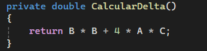
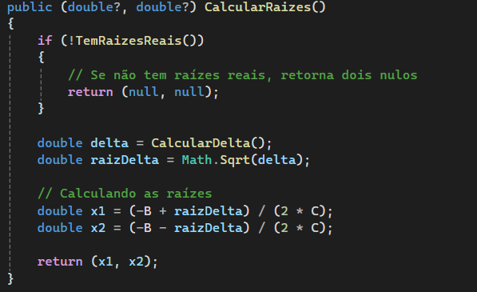
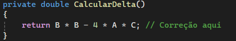
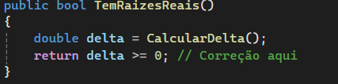
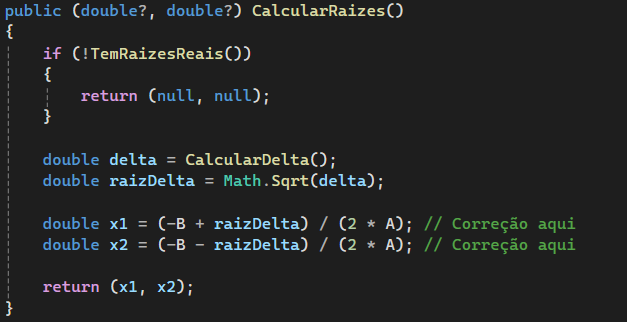
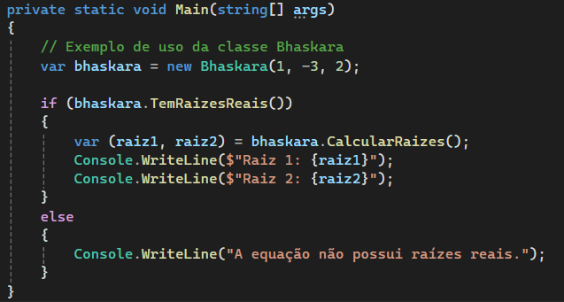
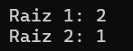
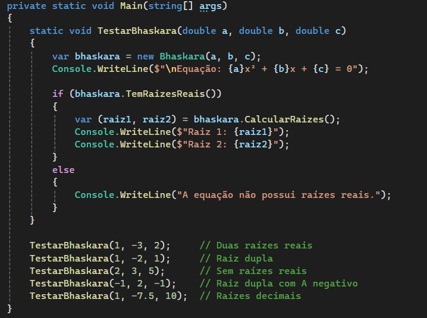
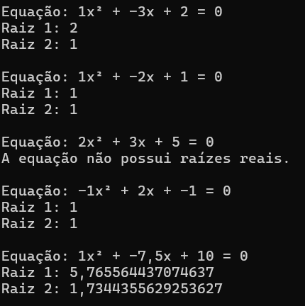
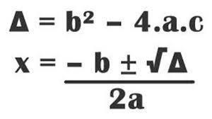

<h1>⚙️ Automação Bhaskara - Enzo Losi</h1>

  Aqui terá um breve resumo de todo processo realizado a fins de corrigir erros pertencentes a classe de aplicação do método de Bhaskara.

<h2>• Erro Analisados</h2>

  Durante a análise e realização de testes no projeto disponibilizado, foi possível identificar erros no cálculo de raízes que deveriam retornar valores reais e simples (como 1, 2, 3, etc.). Ao revisar o código, observou-se que, em certas partes, o cálculo do delta, bem como as operações de multiplicação e divisão envolvendo os coeficientes A, B e C, estavam com valores ou expoentes trocados ou aplicados de forma incorreta, comprometendo a correta aplicação da fórmula de Bhaskara.

 

<h2>📃 Correções Aplicadas</h2>

  Diante dos erros presentes e analisados no projeto, realizei uma breve observação nas linhas do código e efetuei correções simples, porém necessárias para o funcionamento correto do sistema, realizadas nas partes de cálculo do delta da fórmula, na verificação se as raízes são reais, além do cálculo geral final. Assim, após a manutenção e correção das fórmulas matemáticas, iniciei novos testes com diversos números e valores para verificar se a aplicação da fórmula de Bhaskara estava, enfim, sendo realizada corretamente.

 
 

<h2>• Modificação e Testes</h2>

  Durante a etapa de testes, percebeu-se que o entendimento da conta e de seu resultado pelo operador do sistema estava dificultado. Por isso, foi realizada uma modificação no arquivo Program.cs para possibilitar a realização de múltiplas contas, retornando a fórmula escrita matematicamente, juntamente com seus respectivos resultados. Essa alteração visa proporcionar maior clareza no entendimento das operações realizadas pelo sistema, evidenciando de forma nítida a expressão matemática e as raízes calculadas.

<h2>• 1º Versão</h2>
 
 

<h2>• 2º Versão</h2>

<h2>→ Formula de Bhaskara</h2>

